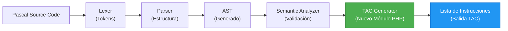

# Arquitectura de Software: Generador de TAC en PHP

## Introducción

Este documento define la **arquitectura del software** que implementará el generador de **Código en Tres Direcciones (TAC)** en PHP para el compilador de Pascal. Esta arquitectura toma como base fundamental las reglas mapeadas en el documento "Tabla_Transformacion_AST_TAC.md", estableciendo cómo el analizador se estructurará a nivel de código fuente para materializar la traducción del árbol de operaciones. Sirve como la guía definitiva de implementación modular para el equipo de desarrollo backend.

---

## 1. Arquitectura General del Sistema

El generador TAC no actuará de forma aislada, sino que se integrará con las fases de análisis que ya provee el entorno (analizador léxico, sintáctico y semántico existentes). El diseño se orquesta alrededor de recibir el Árbol Sintáctico Abstracto (AST) ya validado e íntegro.

**Flujo de Ejecución Global del Compilador:**



En este ecosistema cerrado, nuestro componente principal (`TAC Generator`) asumirá la total responsabilidad del back-end lógico, delegando al visualizador el renderizado del búfer de lista resultante.

---

## 2. Estructura de Carpetas del Proyecto PHP

Para evitar el acoplamiento y promover un diseño SOLID y mantenible, el sistema PHP se distribuirá arquitectónicamente en los siguientes directorios y clases:

```text
/tac-generator (Módulo Base)
 ├── /core                  # Lógica central del motor
 │    ├── TACGenerator.php  # Orquestador y punto de entrada
 │    └── ASTWalker.php     # Navegador Postorden del árbol (Visitor)
 │
 ├── /managers              # Control de asignaciones dinámicas
 │    ├── TempManager.php   # Generador de variables (t1, t2...)
 │    └── LabelManager.php  # Generador de saltos lógicos (L1, L2...)
 │
 ├── /nodes                 # Opcional: Modelado extra para mapeo de Nodos
 │    └── NodeTypes.php     # Catálogo de validación de elementos (Enum/Constantes)
 │
 ├── /output                # Manejo de la memoria generada
 │    └── InstructionList.php # Almacén y formateado del búfer de salida TAC
 │
 └── /ui                    # Presentación frontend interactiva
      └── visualizador_tac.php # UI (HTML+Prism.js) que renderizará la Lista de TAC
```

**Responsabilidades de la Estructura:**
*   **`/core`**: Contiene la lógica profunda del recorrido algorítmico y delegación.
*   **`/managers`**: Encapsulan variables de estado y control estricto que evitan la sobre-escritura de metadatos de flujo.
*   **`/nodes`**: Sirve como capa de compatibilidad formal si se requiere empaquetar constantes de tipos.
*   **`/output`**: Asegura un encapsulado único al registro de salida; un array controlado inyectable al frontend.
*   **`/ui`**: La parte del cliente.

---

## 3. Componentes Principales del Sistema

A nivel de orientación a objetos (OOP), el diseño definirá las siguientes clases e interactuará de modo que cada "Manager" y "Walker" cumplan el Principio de Responsabilidad Única.

### TACGenerator
*   **Responsabilidad:** Actuar como el controlador principal (Fachada). Inicializa las demás clases, recibe el AST limpio y coordina la ejecución desde la raíz y devuelve el resultado en texto manipulable.

### ASTWalker
*   **Responsabilidad:** Implementar el recorrido real y profundo en patrón **Visitor (DFS Postorden)**. Sabe invocar los mánagers cuando aterriza en un BinaryOp o Control Flow, y decide si saltar ramas o recolectar literales basándose en las bases pautadas.

### TempManager
*   **Responsabilidad:** Crear variables temporales estrictas `t1`, `t2`, `t3` sin colapsar y resguardando contadores lógicos numéricos de forma autoincremental en memoria activa.

### LabelManager
*   **Responsabilidad:** Producir saltos incrementales incondicionalmente únicos: `L1`, `L2`, `L3` para poder encapsular el flujo en las validaciones abstractas de control (Loops y Branching).

### InstructionList
*   **Responsabilidad:** Gestionar un búfer persistente estructurado (Array interno) que consolide las filas resultantes. Expondrá un método `__toString()` u orientados, como:
    ```text
    t1 = b * c
    t2 = a + t1
    x = t2
    ```

---

## 4. Flujo Interno del Generador (Algoritmo Abstracto)

Internamente, cuando la plataforma en PHP despacha el controlador principal, la rutina sigue estos pasos imperativos de resolución continua:

1.  **Recibir nodo del AST:** Se extrae de la estructura del objeto devuelto por el Analizador Semántico.
2.  **Determinar tipo de nodo:** El ASTWalker clasifica en memoria qué elemento en el catálogo de traducción se va a operar (Hoja vs Raíz Parcial).
3.  **Aplicar regla de generación TAC:** Basado en `Tabla_Transformacion_AST_TAC.md`.
4.  **Generar temporales o etiquetas:** Si la regla dictamina operación múltiple o control lógico, consultar la clase `/managers` correspondiente.
5.  **Agregar instrucción:** Adjuntar el *string* resultante `(res = op1 op op2)` al objeto `InstructionList`.
6.  **Continuar recorrido:** Se escala de regreso vía recursividad (burbujeo ascendente de retornos temporales).

---

## 5. Interfaz y Experiencia del Sistema

El usuario (o el programador depurando el AST) no interactúa en backend profundo.

*   **Entrada:** Subida del texto fuente y sintáctico del **Código Pascal**.
*   **Proceso Trasero:** Lexer y Semántico lo aprueban -> Se inyecta la abstracción (`Node[]`) al `TACGenerator` principal de PHP.
*   **Salida (Interfaz de Muestra):** Código TAC generado final asimilado en una ventana web estática o responsiva (`visualizador_tac.php`). El usuario podrá visualizar visual y textualmente la correspondencia secuencial en los clásicos bloques atómicos que hemos abordado a su tabla.

---

## 6. Pseudocódigo del Generador Principal de PHP

El esqueleto backend consta de un Entry Point (la fachada) y el Walker que separa lógicamente sentencias de expresiones para mayor control escalar.

### Punto de Entrada: TACGenerator

Esta clase actúa como fachada e inicializa todo el proceso, interactuando finalmente con el buffer `InstructionList`.

```php
class TACGenerator {
    
    public function generate($ast) {
        $walker = new ASTWalker();
        
        // Arranca el recorrido desde la raíz del programa
        $walker->generateStatement($ast);
        
        // Extrae el array o string multilínea consolidado
        return InstructionList::getAll();
    }
}
```

### Recorrido del Árbol: ASTWalker

Separar `generateExpression` (que siempre devuelve temporales o valores) de `generateStatement` (que genera acciones y saltos sin devolver variables) permite depurar ramificaciones complejas de forma limpia:

```php
class ASTWalker {

    // Maneja acciones, ciclos lógicos, ramificaciones condicionales e inserciones finales.
    public function generateStatement(Node $node) {
        if ($node === null) return;

        switch ($node->type) {
            
            case NodeType::ASSIGNMENT:
                // Evaluar la parte derecha devolverá una variable T o constante temporal
                $rightTemp = $this->generateExpression($node->right);
                $varName = $node->variable->name;
                InstructionList::add("{$varName} = {$rightTemp}");
                break;

            case NodeType::IF_OP:
                $condTemp = $this->generateExpression($node->condition);
                $labelTrue = LabelManager::newLabel();
                
                InstructionList::add("IfZ {$condTemp} goto {$labelTrue}");
                
                // Procesar recursivamente las sentencias del bloque "THEN"
                $this->generateStatement($node->trueBlock); 
                
                InstructionList::add("{$labelTrue}:");
                break;

            case NodeType::WHILE_OP:
                $lblStart = LabelManager::newLabel();
                $lblEnd = LabelManager::newLabel();
                
                InstructionList::add("{$lblStart}:");
                
                $condTemp = $this->generateExpression($node->condition);
                InstructionList::add("IfZ {$condTemp} goto {$lblEnd}");
                
                $this->generateStatement($node->body);
                InstructionList::add("goto {$lblStart}");
                
                InstructionList::add("{$lblEnd}:");
                break;

            // ... Otros statements (Program, Block, For, ProcedureCall)
        }
    }

    // Maneja devoluciones de R-Values, Aritmética matemática o unaria.
    public function generateExpression(Node $node) {
        if ($node === null) return null;
        
        switch ($node->type) {
            
            case NodeType::CONSTANT:
                return $node->value;
                
            case NodeType::VARIABLE:
                return $node->name;

            case NodeType::BINARY_OP:
                // Recursividad postorden: Expresiones hoja primero
                $left = $this->generateExpression($node->left);
                $right = $this->generateExpression($node->right);
                
                $temp = TempManager::newTemp();
                InstructionList::add("{$temp} = {$left} {$node->op} {$right}");
                
                return $temp; // Burbujear temp a la sentencia del padre
                
            // ... Otros operadores arítmeticos que requieran ser operados dentro de un statement (ej: relacionales)
        }
    }
}
```

---

## 7. Ejemplo de Flujo de Software Completo (Caja Blanca)

Demostración del ecosistema ante un nodo clásico.

**Entrada en Interfaz (Pascal):**
```pascal
while a < 10 do
   x := a + 1;
```

**Paso a Paso del ASTWalker PHP:**
1.  **Llega al Nodo While**: El Walker extrae 2 etiquetas nuevas desde `LabelManager` (`L1`, `L2`). Emite `L1:`.
2.  **Evaluación de Condición**: Salta a evaluar `a < 10`. Identifica el operador `<` y la necesidad de usar `TempManager` (recibe temporal global).
3.  **Generación de Variables y Condición**:
    Emite `t1 = a < 10`.
    El Walker, esperando ese retorno `t1` que volvió desde la recursión de "BinOp", ahora empalma la fuga falsa del 'While' inyectando el Goto condicional: `IfZ t1 goto L2`.
4.  **Cuerpo Interior**: Visita el nodo "Assign `x`". Llama recursivo a su propia derecha (`a + 1`). "BinOp" emite temporal secundario `t2 = a + 1` devolviéndolo. Asignación completa insertando `x = t2`.
5.  **Cierre**: El generador imprime incondicional de regreso: `goto L1` para completar y emitir la etiqueta vacía de escape: `L2:`.

**Resultado Final (En InstructionList búfer):**
```text
L1:
t1 = a < 10
IfZ t1 goto L2
t2 = a + 1
x = t2
goto L1
L2:
```
