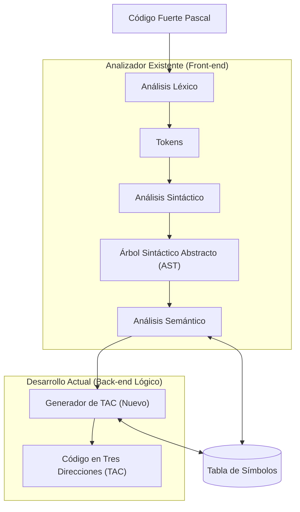
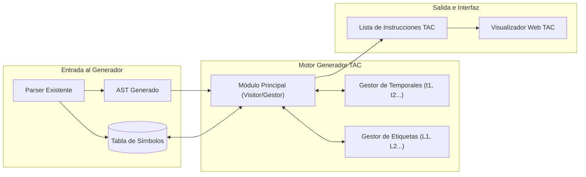
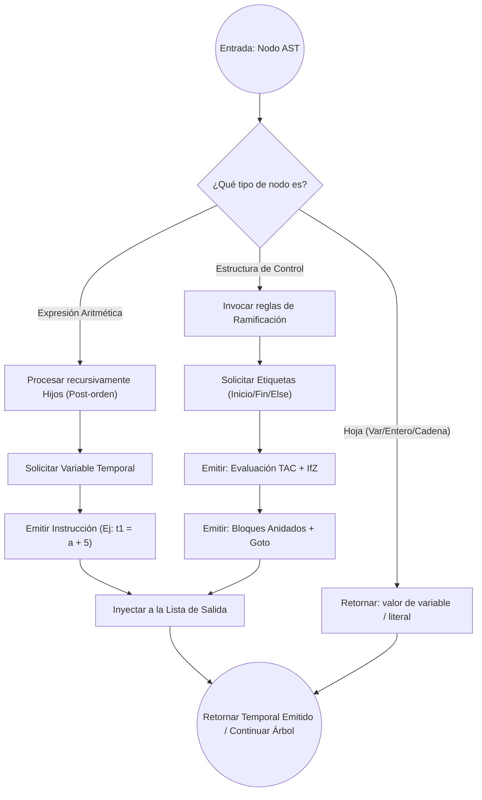
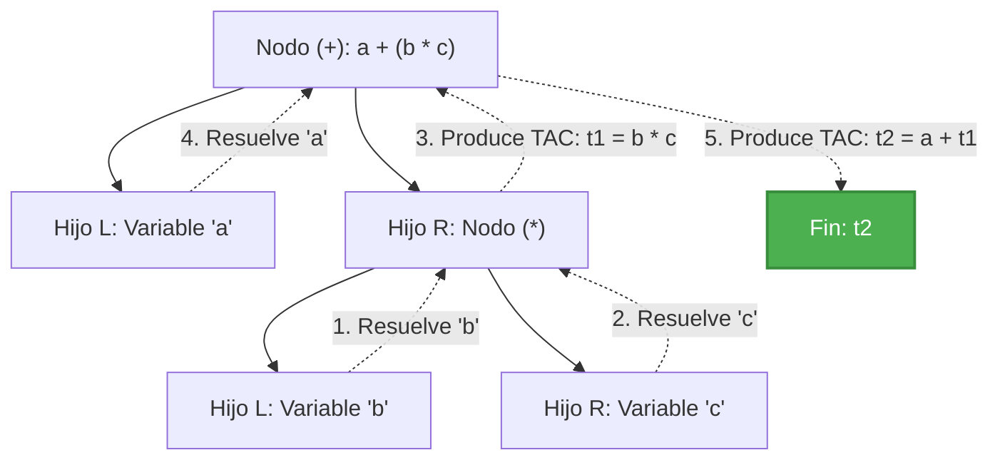
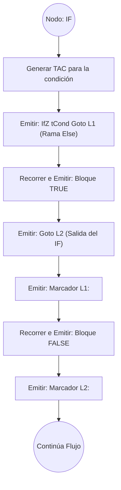
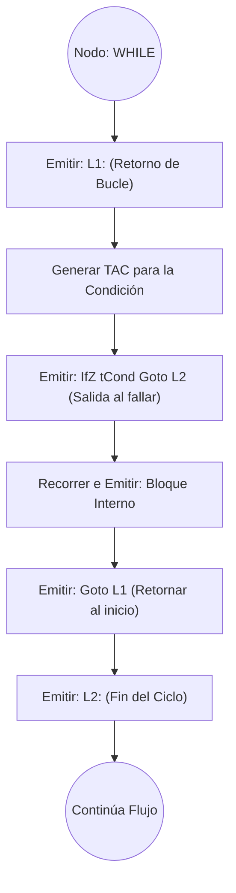
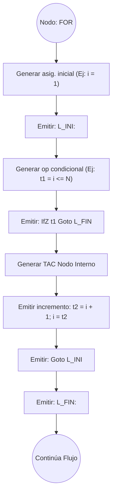
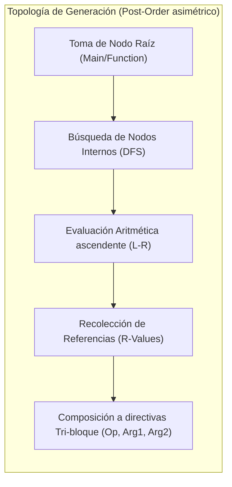

# Arquitectura del Generador de Código en Tres Direcciones (TAC) para Pascal

## Introducción
Este documento detalla la arquitectura, flujos y diagramas del **Generador de Código en Tres Direcciones (TAC)**, concebido como la fase de *back-end* lógico para el compilador de Pascal. El objetivo es proporcionar un diseño técnico, claro y escalable, previo a su implementación, respetando los límites de tres operandos y las estrategias clásicas sugeridas en la bibliografía.

---

## 1. Arquitectura General del Sistema

El siguiente diagrama muestra la relación entre todo el flujo del compilador de Pascal. Destaca la integración del nuevo **Generador TAC** conectándose al ecosistema del analizador actual, aprovechando las fases de análisis (front-end) para tomar el árbol estructurado e iniciar la síntesis.



---

## 2. Arquitectura de Módulos del Generador TAC

El sistema del generador TAC estará desacoplado en varios módulos internos con responsabilidades únicas que garanticen la escalabilidad.



### Responsabilidades Clave:
*   **Módulo Principal (Visitor):** Algoritmo que recorre el AST utilizando el patrón *Visitor*. Delega la traducción a funciones atómicas según el tipo del nodo.
*   **Gestor de Temporales:** Administra la memoria temporal (asignación y recolección controlada de `t1`, `t2`, etc.). Evita el desbordamiento referenciado en el límite de los "operandos de 3 bloques".
*   **Gestor de Etiquetas:** Controla la linealidad proporcionando marcadores únicos (`L1`, `L2`) necesarios para los saltos condicionales (`IfZ`) y directos (`Goto`).
*   **Visualizador Web:** La interfaz en HTML implementada (`visualizador_tac.html`), capaz de leer la lista exportada de instrucciones pre-analizadas mediante sintaxis en pantalla usando Prism.js.

---

## 3. Flujo Interno del Generador TAC

Diagrama de flujo del ciclo de vida algorítmico al momento en que el gestor TAC procesa e inspecciona recursivamente un nodo del AST:



---

## 4. Flujo de Generación para Expresiones

Para traducir expresiones aritméticas respetando la directiva universal limitadora a 3 direcciones, el analizador emplea un árbol evaluado en nivel de hoja a raíz (**Post-orden**).

**Expresión Teórica:** `a + b * c`



### Tabla de Salida Esperada:
```text
t1 = b * c
t2 = a + t1
```

---

## 5. Flujo de Generación para Estructuras de Control

La arquitectura requiere romper el esquema de secuencia mediante etiquetas lógicas para bucles y validadores booleanos condicionales (`IfZ`).

### Condicional IF - ELSE



### Ciclo WHILE



### Ciclo FOR

Dado que Pascal incluye ciclos iterativos rígidos como `FOR i := 1 TO N`, la filosofía de TAC los transforma bajo un modelo similar al `While`, agregando explícitamente variables y contadores.



---

## 6. Diagrama de Recorrido del AST



Explicación técnica: el generador desciende recursivamente (`DFS`) en el código. Al chocar con el nodo terminal (las hojas del árbol), recopila el valor para "escalar" nuevamente hacia su nodo padre inmediato. Se realizan las operaciones sobre las variables hasta llegar de nuevo al nodo de arranque principal. 

---

## 7. Justificación basada en Bibliografía

El modelo presentado se fundamenta en principios sólidos descritos en la literatura y directivas del curso:

1. **Eficiencia en operandos limitados:** Tal y como se documenta en *Bibliografía.md* usando de soporte referencial al diseño base de _Stanford_ "Decaf", un límite obligatorio se impone sobre el número de operandos en el código, a solo 3 fragmentos matemáticos o racionales por línea. Utilizando el módulo "Gestor de Temporales", el diseño asegura dinámicamente este comportamiento.
2. **Generación de secuencias usando 'Gotó' limitativos:** Las derivaciones implementadas en estructuras `IfZ` o en lógicas secuenciales del tipo *While* (`goto S.begin:` vs `goto S.after:`) toman base estricta de implementaciones citadas al modelo general *(Dragon Book: Compilers - Principles, Techniques, and Tools)*.
3. **Optimización con Reciclaje Temporal:** El diseño sugiere recolectar variables temporales que han concluido su propósito de evaluación (Ej: Reusar `t1` una vez liberada del scope), lo cual mitiga el desborde numérico referenciado al *Cap. 480 de Análisis Intermedio*, según *Introduction to Compiling Techniques (Bennett)*.
4. **Cumplimiento de Rúbrica Intelectual:** La arquitectura justifica cómo las expresiones base y las estructuras se convierten, promoviendo claridad visual y técnica esencial para un desarrollo libre de errores colaterales mediante *desacople de módulos*.

---

## 8. Representación Formal de Instrucciones TAC

En la teoría de compiladores, el código en tres direcciones (TAC) se representa de manera formal mediante cuadruplos (aunque lógicamente solo empleen como máximo tres direcciones efectivas y una operación). Se puede conceptualizar cada instrucción como una tupla:

```text
(op, arg1, arg2, result)
```

**Ejemplos Teóricos:**

*   Suma binaria: `(+, a, b, t1)`
*   Multiplicación binaria: `(*, t1, c, t2)`
*   Asignación unaria/directa: `(=, t2, -, x)`

**Representación Textual Equivalente (Formato de Salida):**

```text
t1 = a + b
t2 = t1 * c
x = t2
```

Esta formalidad asegura que ninguna instrucción exceda el límite atómico de **tres operandos**, facilitando la posterior traducción a ensamblador nativo o el pase por optimizadores.

---

## 9. Tabla de transformación AST → TAC

La siguiente tabla consolida cómo se traducen los tipos de nodo analizados del AST hacia su equivalente atómico TAC.

| Nodo AST | Descripción / Pascal Fuente | TAC Generado Equivalente |
| :--- | :--- | :--- |
| **Assignment** | `x := expr` | `x = t` |
| **BinaryOp** | `a + b` | `t = a + b` |
| **UnaryOp** | `-a` | `t = - a` |
| **If** | `if cond then` | `IfZ cond Goto L` |
| **While** | `while cond do` | Etiquetas iterativas (`L1`) + `Goto` |
| **For** | `for i := a to b` | Inicialización + Lógica `While` implícita |
| **ProcedureCall** | `proc(a,b)` | Instrucciones `PushParam` + `LCall` |

---

## 10. Algoritmo de Generación de TAC a partir del AST

El núcleo del generador se basa en un algoritmo recursivo de recorrido en profundidad. El árbol sintáctico se evalúa en **postorden (DFS)** para garantizar que las dependencias de una expresión se resuelvan (y generen temporales) antes de operar sobre ellas.

**Pseudocódigo Conceptual del Algoritmo:**

```pascal
function generate(node)
    // Caso 1: Hoja (Constantes y variables directas)
    if node es Constante
        return node.valor
        
    if node es Variable
        return node.nombre_variable

    // Caso 2: Nodos de Expresión Binaria
    if node es OperadorBinario
        // Recursividad Postorden (DFS): Ramas primero
        left = generate(node.left)
        right = generate(node.right)
        
        // Obtención de nueva temporal para la operación actual
        temp = newTemp() 
        
        // Emisión inmediata de la instrucción a buffer global
        emit(temp + ' = ' + left + ' ' + node.op + ' ' + right)
        
        // El nodo actual ahora se representa por su temporal
        return temp
```

---

## 11. Gestión de Temporales

La generación de variables referenciadas sintéticamente garantiza que las expresiones se almacenen progresivamente sin violar la restricción del diseño (cada tupla solo referenciada 3 veces). Para ello, un módulo específico se encarga de crear, rotar e instanciar estos valores.

**Pseudocódigo del Gestor:**

```pascal
global tempCounter = 0

function newTemp()
    // Incremento atómico para la vida del proceso
    tempCounter = tempCounter + 1
    return "t" + tempCounter
```

**Justificación:** Las temporales `t1`, `t2`, `t3` absorben la complejidad de expresiones compuestas. Por ejemplo, `(a+b)*c` no puede evaluarse en un solo paso TAC, siendo obligatorio dividirlo y crear la interrupción referida.

---

## 12. Generación de Etiquetas para Control de Flujo

De la misma forma que para los temporales, existe un sistema para abstraer la numeración de los marcadores posicionales (Etiquetas / Labels), de manera que una dirección de desvío no colisione nunca en la linearidad del buffer de salida TAC.

**Pseudocódigo del Gestor de Etiquetas:**

```pascal
global labelCounter = 0

function newLabel()
    labelCounter = labelCounter + 1
    return "L" + labelCounter
```

**Ejemplo de Aplicación Generada TAC:**

```text
// Nodo IfZ usa la lógica de salto mediante Goto
IfZ t1 Goto L1
... (código if true)
Goto L2
L1:
... (código if false)
L2:
```

---

## 13. Ejemplo Completo de Transformación AST ➔ TAC

El siguiente bloque compila una demostración desde la escritura nativa de Pascal, abordando su conceptualización abstracta y terminando en el bloque final ensamblado.

**1. Código Pascal Fuente:**

```pascal
x := a + b * c;
```

**2. Visualización Conceptual del Árbol Sintáctico (AST):**
El Parser enviará esta abstracción al módulo generador:

```text
    (:=)
   /    \
 (x)    (+)
       /   \
     (a)   (*)
          /   \
        (b)   (c)
```

**3. Secuencia TAC Generada (Salida del Módulo de Interfaz):**

El generador, debido al esquema postorden descrito en las secciones previas de algoritmos, emitirá las instrucciones con la siguiente jerarquía:

```text
t1 = b * c
t2 = a + t1
x = t2
```
