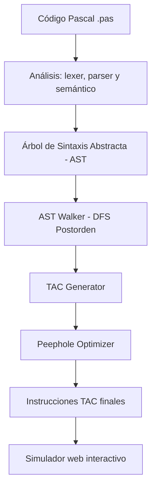

# ☄️ TAC Generator for Pascal - Equipo Penguin 🐧


Un compilador parcial y visualizador de **Código de Tres Direcciones (TAC)** para el lenguaje Pascal de alto rendimiento. Este sistema transforma programas Pascal en una representación intermedia de bajo nivel, permitiendo una depuración secuencial y pedagógica del flujo de datos.

---

## 🧠 Arquitectura del sistema

El generador sigue un diseño modular y desacoplado, garantizando que cada fase del pipeline de compilación sea independiente y robusta.



### Componentes clave:
*   **AST Walker:** Recorre el árbol de sintaxis respetando estrictamente la jerarquía de operadores matemáticos y lógicos de Pascal.
*   **Manager System:** Cuenta con un `TempManager` para variables temporales (`t1, t2...`) y un `LabelManager` para el control de saltos lógicos (`L1, L2...`).
*   **Peephole Optimizer:** Aplica técnicas de *Jump Threading* para compactar el código intermedio, eliminando saltos redundantes y etiquetas huérfanas.
*   **Visualizador Dinámico:** Interfaz de usuario con estética *Neon-Glassmorphism* que permite navegar por la ejecución del TAC paso a paso.

---

## 🚀 Características principales

*   **Generación de TAC Estricto:** Cada instrucción posee un máximo de tres operandos, ideal para el aprendizaje de arquitectura de computadoras.
*   **Control de Flujo Avanzado:** Soporte total para `IF-ELSE`, bucles `WHILE`, `FOR` y llamadas a subrutinas con pasaje de parámetros por pila.
*   **Navegación Interactiva:**
    *   **🛸 Modo Completo:** Visualización instantánea de toda la traducción.
    *   **▶️ Modo Auto:** Reproducción secuencial automatizada con delay configurable.
    *   **⌨️ Navegación por Teclado:** Use las flechas para explorar el TAC con sincronización de foco en el código original.
*   **Análisis de Tipos:** Inferencia automática de tipos para concatenación híbrida de cadenas y números.
*   **Manual Técnico Integrado:** Documentación interna generable en PDF con estilos optimizados para impresión técnica.

---

## 📂 Estructura del proyecto

```text
/
├── generador_tac/
│   ├── Ejercicios/          # Suite de 19 pruebas modulares (.pas)
│   └── tac-generator/
│       ├── core/            # ASTWalker y TACGenerator principal
│       ├── managers/        # Gestión de Temporales y Etiquetas
│       ├── nodes/           # Definición de tipos de nodos AST
│       ├── output/          # Almacenamiento de instrucciones TAC
│       └── ui/              # Visualizador Web (Frontend/Backend unificado)
├── Tests/                   # Referencias y diagnósticos del sistema
└── README.md                # Esta documentación
```

---

## 🛠️ Instalación y uso

### Prerrequisitos:
*   Servidor web con soporte para **PHP 8.x** (WAMP, XAMPP, Laragon).

### Configuración local:
1. Clona este repositorio o descarga la carpeta `Unidad 2`.
2. Mueve el contenido a tu directorio `www` (WAMP) o `htdocs` (XAMPP).
3. Asegúrate de que la estructura sea: `c:/wamp64/www/Unidad 2/`.
4. **Acceso Directo:** Inicie su servidor y acceda simplemente al directorio raíz: `http://localhost/Unidad 2/`. El archivo **index.php** se encargará de redirigirle automáticamente al simulador interactivo.

---

## 🐧 Equipo Penguin

| Desarrollador | Responsabilidad |
| :--- | :--- |
| **Pedro Cauich Pat** | Arquitectura Back-End & TAC Generator |
| **Brenda Chan Xooc** | Arquitectura Front-End & UX/UI |
| **Danneshe Corona Noh** | QA & Pruebas de Diagnóstico |
| **Karla Cristina Pat Canche** | Documentación Técnica & Manual de Usuario |

### Docente
**Maestro José Leonel Pech May**
*Ingeniería en Sistemas Computacionales · 6° "C"*
**Instituto Tecnológico Superior de Valladolid (ITSVA)**

---

&copy; Copyright 2026 - Equipo Penguin 🐧. Desarrollado para Lenguajes y Autómatas II.
